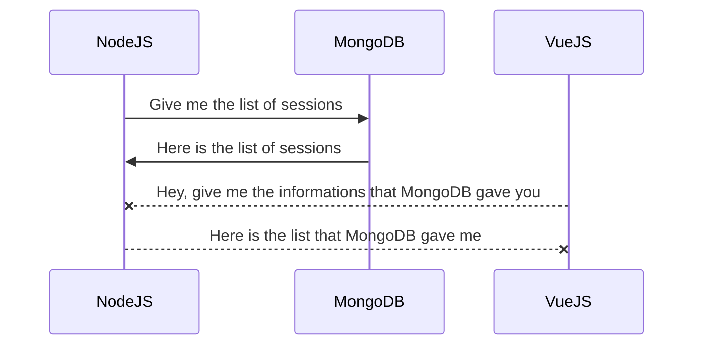

# Node.js Server for Cinema Sessions API

This Node.js server provides an API for managing cinema sessions. It uses Express.js for routing and handling HTTP requests, MongoDB for storing data, and EJS as the view engine for rendering HTML templates.

##  Authors

- [Hugo DI PAOLO](https://github.com/Cliffy57)

## Methods

The server supports the following methods:

-   `GET /sessions`: Retrieves a list of 20 cinema sessions from the database.
-   `PUT /sessions/:id`: Updates an existing session with the specified ID.
-   `DELETE /sessions/:id`: Deletes a session with the specified ID.

## How to Use

To use this server, you must have Node.js and MongoDB installed on your system. Follow these steps:

1.  Clone this repository to your local machine.
2.  Install the required packages by running `npm install` in the project directory.
3.  Start the server by running `node app.js`.
4.  Use a tool like Postman or a web browser to send requests to the server at `http://localhost:8081`
5.  Our MongoDB can be accessed via a Ip adress whitelist, in order to add yours:
5.1 go to https://cloud.mongodb.com/v2/63cbbbe4010a127ae36fb26d#/security/network/accessList
5.2 login as : hugodip@orange.fr password :*h!4`U$:3d&z
5.3 add your IP to the whitelist

## Requirements

This server requires the following packages:

-   `express`: A web framework for Node.js.
-   `mongodb`: The official MongoDB driver for Node.js.
-   `body-parser`: Middleware for parsing HTTP request bodies.
-   `ejs`: A view engine for rendering HTML templates.
-   `cors`: Middleware to enable Cross-Origin Resource Sharing (CORS) for all requests.
## UML diagrams

